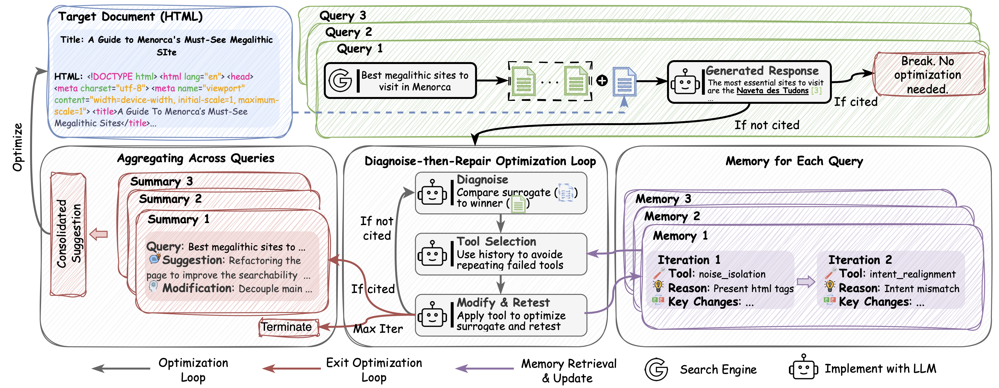

# Diagnosing and Repairing Citation Failures in Generative Engine Optimization

<p align="center">
  <a href='https://zhihuat.github.io/agentgeo/'></a>
  <a href="https://huggingface.co/datasets/GeoAgent/GEO_Agent_with_queries" target="_blank"></a>


</p >

## 📰 News

- [2026.3.10] We release the paper, code and project pages

## ✅ TODO

- [x] Code Release.
- [x] Paper Release.
- [x] Datasets.

## 🧭 Overveiw

AgentGEO is a diagnostic framework for Generative Engine Optimization (GEO). Instead of applying generic rewrites, it diagnoses why a page is not cited and applies targeted repairs.




## ❓ What problem this solves

Generative engines **read your page — then silently ignore it.**
A page can be retrieved into the model's context and still receive zero citations in the final response. For creators, this is a silent traffic drain: the engine saw your work, understood it, and chose not to attribute it.
**AgentGEO** targets this gap between retrieved and cited — diagnosing why pages get dropped from citations and iteratively repairing failure points across the citation pipeline.


## 🌟 Key Features

- **🔄 Adaptive Optimization Loop**: Implements an `Assess → Analyze → Act` cycle that automatically evaluates citation performance, diagnoses issues, and applies fixes iteratively until success.

- **🧠 Competitor Gap Analysis**: Integrates with search APIs (ChatNoir) to compare target pages against top-ranked competitors, identifying content gaps, tone issues, and structural deficiencies.

- **🛠️ Modular Tool System** (11 registered tools):
  - **Content Tools**: `entity_injection`, `bluf_optimization`, `intent_realignment`, `content_relocation`
  - **Structure Tools**: `structure_optimization`, `data_serialization`, `noise_isolation`, `static_rendering`
  - **Persuasion Tools**: `persuasive_rewriting` (6 strategies), `historical_redteam` (5 attack strategies)
  - **Meta Tool**: `autogeo_rephrase` (9 rule sets from AutoGEO paper for comprehensive rewriting)

- **🛡️ Type-Safe Architecture**: Built with **Pydantic** for robust schema validation, ensuring structured LLM outputs are accurate and reliable.

- **🔗 Extensible Design**: Based on **LangChain** with a `Registry` pattern for easy custom tool registration.

## 🚀 Quick Start

### 1. 🧰 Requirements

- Python `3.10+`
- At least one LLM API key:
  - `OPENAI_API_KEY`, or
  - `ANTHROPIC_API_KEY`, or
  - `GEMINI_API_KEY` / `GOOGLE_API_KEY`
- Optional: `CHATNOIR_API_KEY` for retrieval components

### 2. ⚙️ Install

```bash
python -m venv .venv
source .venv/bin/activate  # Windows: .venv\Scripts\activate
pip install -r requirements.txt
```

### 3. 🔐 Configure environment

Create `.env` in repo root:

```env
# Pick one provider (or multiple)
OPENAI_API_KEY=...
# ANTHROPIC_API_KEY=...
# GEMINI_API_KEY=...
# GOOGLE_API_KEY=...

# Optional
CHATNOIR_API_KEY=...
```

### 4. 🗂️ Prepare data

##### Download dataset from Hugging Face (`GeoAgent/GEO_Agent_with_queries`):

```bash
ds = load_dataset('GeoAgent/GEO_Agent_with_queries', split='train')
```


##### If your data only has `raw_html`, generate queries:

```bash
python scripts/generate_queries.py --input data/my_data.parquet
```

Useful flags:

```bash
python scripts/generate_queries.py \
  --input data/my_data.parquet \
  --train-count 20 \
  --test-count 20 \
  --concurrency 16
```

### 5. ▶️ Run optimization

Run a small sanity check first:

```bash
python scripts/run_optimization.py --doc-limit 2
```

Run full AgentGEO:

```bash
python scripts/run_optimization.py --method agentgeo
```

Compare all methods:

```bash
python scripts/run_optimization.py --method all
```

Common overrides:

```bash
python scripts/run_optimization.py \
  --method agentgeo \
  --data data/input.parquet \
  --output-dir outputs \
  --doc-concurrency 2
```

## 🧪 Methods

`--method` in `scripts/run_optimization.py` supports:

- `agentgeo`: Diagnose-then-repair optimization (main method)
- `autogeo`: AutoGEO baseline
- `baseline`: GEO-Bench baseline optimizers
- `all`: run all configured methods

## 🛠️ Key Config Files

- Main pipeline config: `optimization_config.yaml`
- Agent module config: `geo_agent/config.yaml`

Important fields in `optimization_config.yaml`:

- `optimizer.method`: method selector
- `data.input_path`, `data.doc_limit`, `data.doc_offset`
- `output.base_dir`
- `evaluation.enable_citation`
- `agentgeo.citation_method` (`llm`, `attr_evaluator`, `both`)


## 📚 Citation

If you use this repository, cite:

```bibtex
@article{tian2026agentgeo,
  title={Diagnosing and Repairing Citation Failures in Generative Engine Optimization},
  author={Tian, Zhihua and Chen, Yuhan and Tang, Yao and Liu, Jian and Jia, Ruoxi},
  year={2026}
}
```
